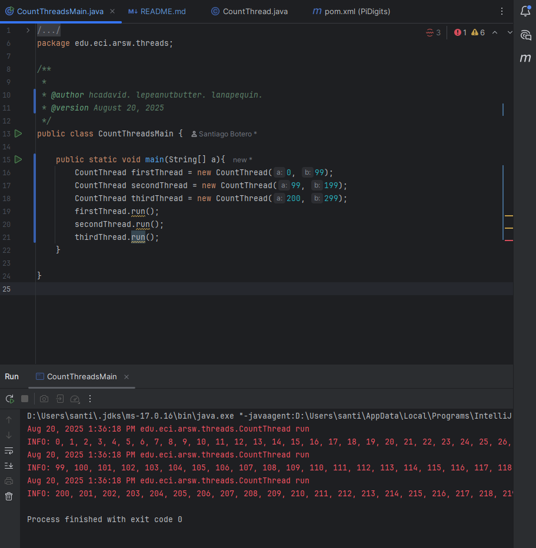

### Escuela Colombiana de Ingeniería
### Arquitecturas de Software - ARSW
## Ejercicio Introducción al paralelismo - Hilos - Caso BlackListSearch

### Descripción
Este ejercicio introduce los conceptos básicos de la programación con hilos en Java. Además, explora cómo implementar y controlar la ejecución de estos hilos, específicamente en el contexto de un caso práctico. Para facilitar el desarrollo, se ha utilizado Lombok para generar automáticamente los métodos getters y setters, mejorando la eficiencia del código.

El laboratorio se ha desarrollado utilizando el entorno IntelliJ IDEA Community Edition, y para asegurar la calidad del código y detectar posibles errores o vulnerabilidades, se ha integrado análisis estático mediante SonarQube for IDE o SonarLint, permitiendo así mantener buenas prácticas de codificación durante todo el proceso de desarrollo.

### **Parte I - Introducción a Hilos en Java**

#### **1. Implementación de la Clase CountThread**

El primer paso consistió en la implementación de la clase CountThread, que define el ciclo de vida de un hilo. El propósito de esta clase es imprimir en pantalla los números dentro de un rango determinado, desde A hasta B. En este caso, se decidió usar streams para gestionar de manera eficiente la impresión de los números.

El uso de streams en Java facilita el manejo de colecciones y la ejecución de operaciones de manera más declarativa y controlada. Al emplear streams, se tiene un control más fino sobre la secuencia de salida y la sincronización de los resultados, reduciendo posibles inconsistencias al manejar múltiples hilos.

#### **2. Creación y Ejecución de los Hilos**

Una vez que se implementó la clase CountThread, se crearon tres instancias de esta clase, cada una con un rango diferente de números:

- Hilo 1: desde [0..99]
- Hilo 2: desde [99..199]
- Hilo 3: desde [200..299]

El objetivo era observar cómo se comportan estos hilos al ejecutarse en paralelo y comparar el resultado cuando se ejecutan utilizando dos enfoques distintos: start() y run().

**Prueba de Ejecución con start()**

El método start() de la clase Thread en Java crea un hilo de ejecución real y lo lanza. Al utilizar start(), los hilos se ejecutan de manera concurrente, lo que provoca que los números se impriman en un orden aparentemente aleatorio, ya que cada hilo se ejecuta en su propio hilo de ejecución.

**Prueba de Ejecución con run()**

Por otro lado, cuando se utiliza run(), el código se ejecuta de manera secuencial, sin crear hilos adicionales. Esto significa que los números se imprimen en un orden más predecible y secuencial, ya que solo se está ejecutando el hilo principal, y no los hilos concurrentes.

#### **3. Razón para el Uso de Streams**

El uso de streams en esta implementación tiene un propósito fundamental: proporcionar un mejor control sobre los resultados, al garantizar que la salida se maneje de manera controlada y predecible dentro de los hilos. En programación concurrente, uno de los mayores desafíos es asegurar que los hilos no interfieran entre sí y que los recursos compartidos se gestionen adecuadamente.

En el caso de este ejercicio, los streams permiten manejar la impresión de los números de manera eficiente y limpia, garantizando que los hilos puedan compartir recursos sin causar conflictos. En un escenario real, este enfoque mejora la legibilidad y el mantenimiento del código.

**Refactorización del Código:** Uso de for loops en Lugar de Streams

Para observar las diferencias en la ejecución, se refactorizó el código de CountThread para usar bucles for tradicionales en lugar de streams. Esta refactorización muestra cómo el comportamiento de los hilos cambia según el método de ejecución.

Al ejecutar nuevamente el código con start(), los resultados siguen siendo desordenados, ya que los hilos se ejecutan en paralelo y no hay garantía del orden de impresión.

Sin embargo, cuando se utiliza run(), el código sigue ejecutándose de manera secuencial, imprimiendo los números en orden, ya que no se están creando hilos concurrentes.

**Parte II - Ejercicio Black List Search**

Para un software de vigilancia automática de seguridad informática se está desarrollando un componente encargado de validar las direcciones IP en varios miles de listas negras (de host maliciosos) conocidas, y reportar aquellas que existan en al menos cinco de dichas listas. 

Dicho componente está diseñado de acuerdo con el siguiente diagrama, donde:

- HostBlackListsDataSourceFacade es una clase que ofrece una 'fachada' para realizar consultas en cualquiera de las N listas negras registradas (método 'isInBlacklistServer'), y que permite también hacer un reporte a una base de datos local de cuando una dirección IP se considera peligrosa. Esta clase NO ES MODIFICABLE, pero se sabe que es 'Thread-Safe'.

- HostBlackListsValidator es una clase que ofrece el método 'checkHost', el cual, a través de la clase 'HostBlackListDataSourceFacade', valida en cada una de las listas negras un host determinado. En dicho método está considerada la política de que al encontrarse un HOST en al menos cinco listas negras, el mismo será registrado como 'no confiable', o como 'confiable' en caso contrario. Adicionalmente, retornará la lista de los números de las 'listas negras' en donde se encontró registrado el HOST.

Al usarse el módulo, la evidencia de que se hizo el registro como 'confiable' o 'no confiable' se dá por lo mensajes de LOGs:

INFO: HOST 205.24.34.55 Reported as trustworthy

INFO: HOST 205.24.34.55 Reported as NOT trustworthy

Al programa de prueba provisto (Main), le toma sólo algunos segundos análizar y reportar la dirección provista (200.24.34.55), ya que la misma está registrada más de cinco veces en los primeros servidores, por lo que no requiere recorrerlos todos. Sin embargo, hacer la búsqueda en casos donde NO hay reportes, o donde los mismos están dispersos en las miles de listas negras, toma bastante tiempo.

Éste, como cualquier método de búsqueda, puede verse como un problema [vergonzosamente paralelo](https://en.wikipedia.org/wiki/Embarrassingly_parallel), ya que no existen dependencias entre una partición del problema y otra.

Para 'refactorizar' este código, y hacer que explote la capacidad multi-núcleo de la CPU del equipo, realice lo siguiente:

1. Cree una clase de tipo Thread que represente el ciclo de vida de un hilo que haga la búsqueda de un segmento del conjunto de servidores disponibles. Agregue a dicha clase un método que permita 'preguntarle' a las instancias del mismo (los hilos) cuantas ocurrencias de servidores maliciosos ha encontrado o encontró.

2. Agregue al método 'checkHost' un parámetro entero N, correspondiente al número de hilos entre los que se va a realizar la búsqueda (recuerde tener en cuenta si N es par o impar!). Modifique el código de este método para que divida el espacio de búsqueda entre las N partes indicadas, y paralelice la búsqueda a través de N hilos. Haga que dicha función espere hasta que los N hilos terminen de resolver su respectivo sub-problema, agregue las ocurrencias encontradas por cada hilo a la lista que retorna el método, y entonces calcule (sumando el total de ocurrencuas encontradas por cada hilo) si el número de ocurrencias es mayor o igual a _BLACK_LIST_ALARM_COUNT_. Si se da este caso, al final se DEBE reportar el host como confiable o no confiable, y mostrar el listado con los números de las listas negras respectivas. Para lograr este comportamiento de 'espera' revise el método [join](https://docs.oracle.com/javase/tutorial/essential/concurrency/join.html) del API de concurrencia de Java. Tenga también en cuenta:

	* Dentro del método checkHost Se debe mantener el LOG que informa, antes de retornar el resultado, el número de listas negras revisadas VS. el número de listas negras total (línea 60). Se debe garantizar que dicha información sea verídica bajo el nuevo esquema de procesamiento en paralelo planteado.

	* Se sabe que el HOST 202.24.34.55 está reportado en listas negras de una forma más dispersa, y que el host 212.24.24.55 NO está en ninguna lista negra.

**Parte II.I Para discutir la próxima clase (NO para implementar aún)**

La estrategia de paralelismo antes implementada es ineficiente en ciertos casos, pues la búsqueda se sigue realizando aún cuando los N hilos (en su conjunto) ya hayan encontrado el número mínimo de ocurrencias requeridas para reportar al servidor como malicioso. Cómo se podría modificar la implementación para minimizar el número de consultas en estos casos?, qué elemento nuevo traería esto al problema?

**Parte III - Evaluación de Desempeño**

A partir de lo anterior, implemente la siguiente secuencia de experimentos para realizar las validación de direcciones IP dispersas (por ejemplo 202.24.34.55), tomando los tiempos de ejecución de los mismos (asegúrese de hacerlos en la misma máquina):

1. Un solo hilo.
2. Tantos hilos como núcleos de procesamiento (haga que el programa determine esto haciendo uso del [API Runtime](https://docs.oracle.com/javase/7/docs/api/java/lang/Runtime.html)).
3. Tantos hilos como el doble de núcleos de procesamiento.
4. 50 hilos.
5. 100 hilos.

Al iniciar el programa ejecute el monitor jVisualVM, y a medida que corran las pruebas, revise y anote el consumo de CPU y de memoria en cada caso. 

Con lo anterior, y con los tiempos de ejecución dados, haga una gráfica de tiempo de solución vs. número de hilos. Analice y plantee hipótesis con su compañero para las siguientes preguntas (puede tener en cuenta lo reportado por jVisualVM):

**Parte IV - Ejercicio Black List Search**

1. Según la [ley de Amdahls](https://www.pugetsystems.com/labs/articles/Estimating-CPU-Performance-using-Amdahls-Law-619/#WhatisAmdahlsLaw?):

	, donde _S(n)_ es el mejoramiento teórico del desempeño, _P_ la fracción paralelizable del algoritmo, y _n_ el número de hilos, a mayor _n_, mayor debería ser dicha mejora. Por qué el mejor desempeño no se logra con los 500 hilos?, cómo se compara este desempeño cuando se usan 200?. 

2. Cómo se comporta la solución usando tantos hilos de procesamiento como núcleos comparado con el resultado de usar el doble de éste?.

3. De acuerdo con lo anterior, si para este problema en lugar de 100 hilos en una sola CPU se pudiera usar 1 hilo en cada una de 100 máquinas hipotéticas, la ley de Amdahls se aplicaría mejor?. Si en lugar de esto se usaran c hilos en 100/c máquinas distribuidas (siendo c es el número de núcleos de dichas máquinas), se mejoraría?. Explique su respuesta.

