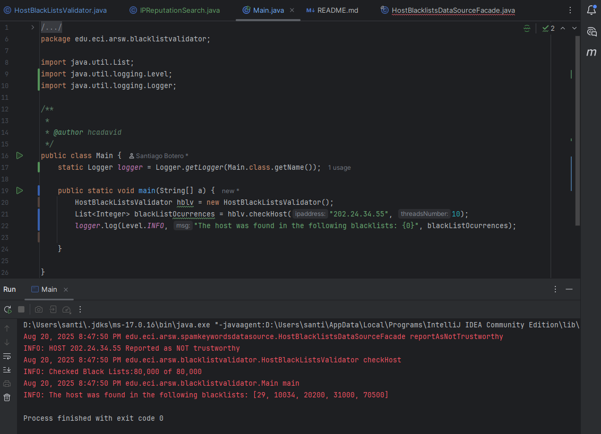
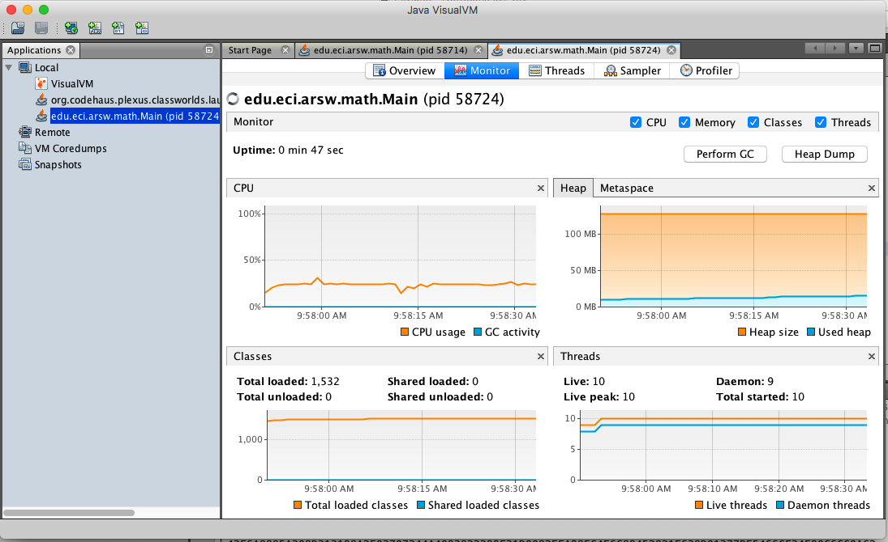

### Escuela Colombiana de Ingeniería
### Arquitecturas de Software - ARSW
## Ejercicio Introducción al paralelismo - Hilos - Caso BlackListSearch

### Integrantes
Laura Natalia Perilla Quintero - lanapequin[]
Santiago Botero Garcia - LePeanutButter

### Descripción
Este ejercicio introduce los conceptos básicos de la programación con hilos en Java. Además, explora cómo implementar y controlar la ejecución de estos hilos, específicamente en el contexto de un caso práctico. Para facilitar el desarrollo, se ha utilizado Lombok para generar automáticamente los métodos getters y setters, mejorando la eficiencia del código.

El laboratorio se ha desarrollado utilizando el entorno IntelliJ IDEA Community Edition, y para asegurar la calidad del código y detectar posibles errores o vulnerabilidades, se ha integrado análisis estático mediante SonarQube for IDE o SonarLint, permitiendo así mantener buenas prácticas de codificación durante todo el proceso de desarrollo.

### **Parte I - Introducción a Hilos en Java**

#### **1. Implementación de la Clase CountThread**

El primer paso consistió en la implementación de la clase CountThread, que define el ciclo de vida de un hilo. El propósito de esta clase es imprimir en pantalla los números dentro de un rango determinado, desde A hasta B. En este caso, se decidió usar streams para gestionar de manera eficiente la impresión de los números.

El uso de streams en Java facilita el manejo de colecciones y la ejecución de operaciones de manera más declarativa y controlada. Al emplear streams, se tiene un control más fino sobre la secuencia de salida y la sincronización de los resultados, reduciendo posibles inconsistencias al manejar múltiples hilos.

#### **2. Creación y Ejecución de los Hilos**

Una vez que se implementó la clase CountThread, se crearon tres instancias de esta clase, cada una con un rango diferente de números:

- Hilo 1: desde [0..99]
- Hilo 2: desde [99..199]
- Hilo 3: desde [200..299]

El objetivo era observar cómo se comportan estos hilos al ejecutarse en paralelo y comparar el resultado cuando se ejecutan utilizando dos enfoques distintos: start() y run().

**Prueba de Ejecución con start()**

El método start() de la clase Thread en Java crea un hilo de ejecución real y lo lanza. Al utilizar start(), los hilos se ejecutan de manera concurrente, lo que provoca que los números se impriman en un orden aparentemente aleatorio, ya que cada hilo se ejecuta en su propio hilo de ejecución.

**Prueba de Ejecución con run()**

Por otro lado, cuando se utiliza run(), el código se ejecuta de manera secuencial, sin crear hilos adicionales. Esto significa que los números se imprimen en un orden más predecible y secuencial, ya que solo se está ejecutando el hilo principal, y no los hilos concurrentes.

#### **3. Razón para el Uso de Streams**

El uso de streams en esta implementación tiene un propósito fundamental: proporcionar un mejor control sobre los resultados, al garantizar que la salida se maneje de manera controlada y predecible dentro de los hilos. En programación concurrente, uno de los mayores desafíos es asegurar que los hilos no interfieran entre sí y que los recursos compartidos se gestionen adecuadamente.

En el caso de este ejercicio, los streams permiten manejar la impresión de los números de manera eficiente y limpia, garantizando que los hilos puedan compartir recursos sin causar conflictos. En un escenario real, este enfoque mejora la legibilidad y el mantenimiento del código.

**Refactorización del Código:** Uso de for loops en Lugar de Streams

Para observar las diferencias en la ejecución, se refactorizó el código de CountThread para usar bucles for tradicionales en lugar de streams. Esta refactorización muestra cómo el comportamiento de los hilos cambia según el método de ejecución.

Al ejecutar nuevamente el código con start(), los resultados siguen siendo desordenados, ya que los hilos se ejecutan en paralelo y no hay garantía del orden de impresión.

Sin embargo, cuando se utiliza run(), el código sigue ejecutándose de manera secuencial, imprimiendo los números en orden, ya que no se están creando hilos concurrentes.

### **Parte II - Ejercicio Black List Search**

El propósito del ejercicio es implementar un componente de seguridad informática que valide la reputación de direcciones IP sospechosas. Para esto, se consulta si una IP aparece en listas negras conocidas (blacklists) que contienen registros de hosts potencialmente maliciosos.

La política de detección es:

- Si una IP aparece en 5 o más listas negras, se considera no confiable.
- Si aparece en menos de 5, se considera confiable.

Este proceso se repite para muchas IPs y sobre miles de listas negras, por lo que la solución debe ser rápida y eficiente, especialmente cuando:

- Las coincidencias están muy dispersas.
- O no hay coincidencias (requiere revisar todas las listas).

El algoritmo inicial hacía la verificación de forma secuencial, lo que causaba que:
- Algunas búsquedas tardaran varios segundos o más.
- No se aprovechara la capacidad de múltiples núcleos del procesador.

Además, como no hay dependencia entre las verificaciones, este es un problema que puede considerarse "vergonzosamente paralelo", es decir, ideal para multihilos.

Para optimizar el rendimiento, se refactorizó el código para usar múltiples hilos, dividiendo el trabajo entre ellos.

**Clase IPReputationSearch**

**Propósito:**

- Cada hilo busca la IP en una porción de las listas negras.
- Guarda los índices donde la IP fue encontrada.
- Permite conocer cuántas listas fueron revisadas.

**Método Refactorizado checkHost**

**Qué hace esta refactorización:**

- Divide el total de listas negras en N bloques según la cantidad de hilos.
- Lanza N instancias de IPReputationSearch (una por hilo).
- Espera a que terminen (join).
- Recolecta los resultados.
- Reporta la IP como confiable o no confiable.

Se probaron dos direcciones IP conocidas:

1. 202.24.34.55 - Esta IP sí aparece en las listas negras, pero de forma dispersa. Resultado esperado: confiabilidad detectada correctamente.
2. 212.24.24.55 - Esta IP no aparece en ninguna lista negra. Resultado esperado: detectada como confiable, sin falsos positivos.

Ambas pruebas se ejecutaron utilizando 10 hilos, y los resultados fueron correctos en todos los casos, con mejora en el tiempo de ejecución.

**Parte III - Evaluación de Desempeño**

A partir de lo anterior, implemente la siguiente secuencia de experimentos para realizar las validación de direcciones IP dispersas (por ejemplo 202.24.34.55), tomando los tiempos de ejecución de los mismos (asegúrese de hacerlos en la misma máquina):

1. Un solo hilo.
2. Tantos hilos como núcleos de procesamiento (haga que el programa determine esto haciendo uso del [API Runtime](https://docs.oracle.com/javase/7/docs/api/java/lang/Runtime.html)).
3. Tantos hilos como el doble de núcleos de procesamiento.
4. 50 hilos.
5. 100 hilos.

Al iniciar el programa ejecute el monitor jVisualVM, y a medida que corran las pruebas, revise y anote el consumo de CPU y de memoria en cada caso. 

Con lo anterior, y con los tiempos de ejecución dados, haga una gráfica de tiempo de solución vs. número de hilos. Analice y plantee hipótesis con su compañero para las siguientes preguntas (puede tener en cuenta lo reportado por jVisualVM):

**Parte IV - Ejercicio Black List Search**

1. Según la [ley de Amdahls](https://www.pugetsystems.com/labs/articles/Estimating-CPU-Performance-using-Amdahls-Law-619/#WhatisAmdahlsLaw?):

	, donde _S(n)_ es el mejoramiento teórico del desempeño, _P_ la fracción paralelizable del algoritmo, y _n_ el número de hilos, a mayor _n_, mayor debería ser dicha mejora. Por qué el mejor desempeño no se logra con los 500 hilos?, cómo se compara este desempeño cuando se usan 200?. 

2. Cómo se comporta la solución usando tantos hilos de procesamiento como núcleos comparado con el resultado de usar el doble de éste?.

3. De acuerdo con lo anterior, si para este problema en lugar de 100 hilos en una sola CPU se pudiera usar 1 hilo en cada una de 100 máquinas hipotéticas, la ley de Amdahls se aplicaría mejor?. Si en lugar de esto se usaran c hilos en 100/c máquinas distribuidas (siendo c es el número de núcleos de dichas máquinas), se mejoraría?. Explique su respuesta.

